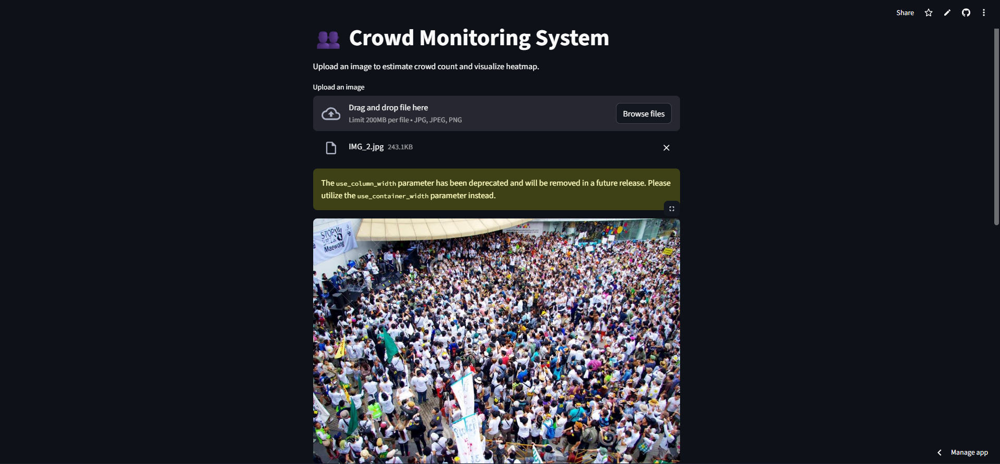
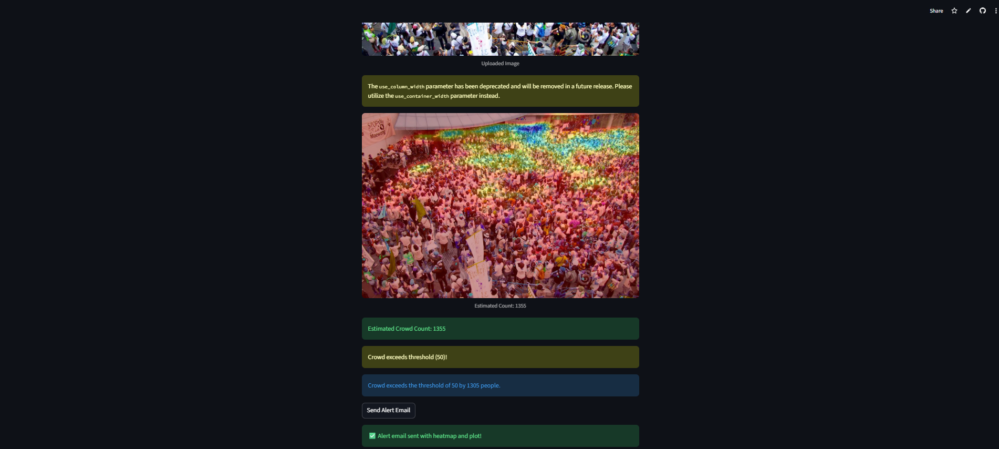
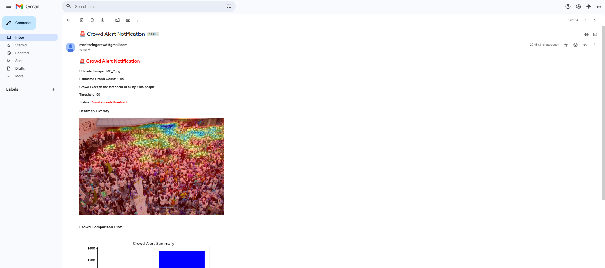
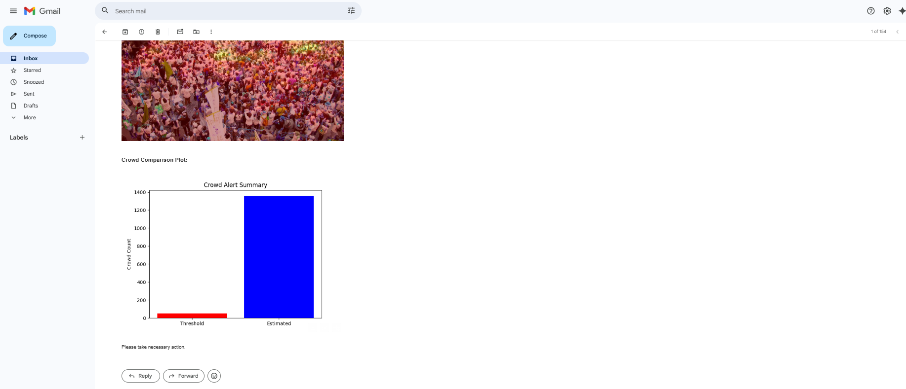

Crowd Monitoring App with alerts

A real-time crowd counting system using CSRNet that sends email alerts when crowd size exceeds a configurable threshold. The app visualizes crowd density with heatmaps and provides informative HTML email alerts with plots.  

Features

- Upload images (jpg, jpeg, png) to estimate crowd count.
- Heatmap overlay showing crowd density on the image.
- Sends HTML email alerts with heatmap and comparison plots.
- Configurable crowd threshold for alerts.
- Fully in-memory processing (no disk writes).

Demo

Installation

- git clone https://github.com/rakshita0412/CrowdMonitoring.git
- cd CrowdMonitoring
- pip install -r requirements.txt
- streamlit run src/app.py

ENVIRONMENT VARIABLES
- SMTP_USER=your_email@gmail.com
- SMTP_PASS=your_app_password
- ALERT_RECIPIENT=recipient_email@gmail.com

MODEL WEIGHTS
- This project requires CSRNet model weights (csrnet_train.pth) to run inference.
- Train the model using the provided training code (src/training.py) and your dataset.
-  This will generate a weights file (e.g., csrnet_train.pth).
-  Once obtained, place the file inside the csrnet_model/ folder.

USAGE
- Upload an image via the app UI.
- View the estimated crowd count and heatmap overlay.
- If the count exceeds the configured threshold, an email alert will be sent automatically.

