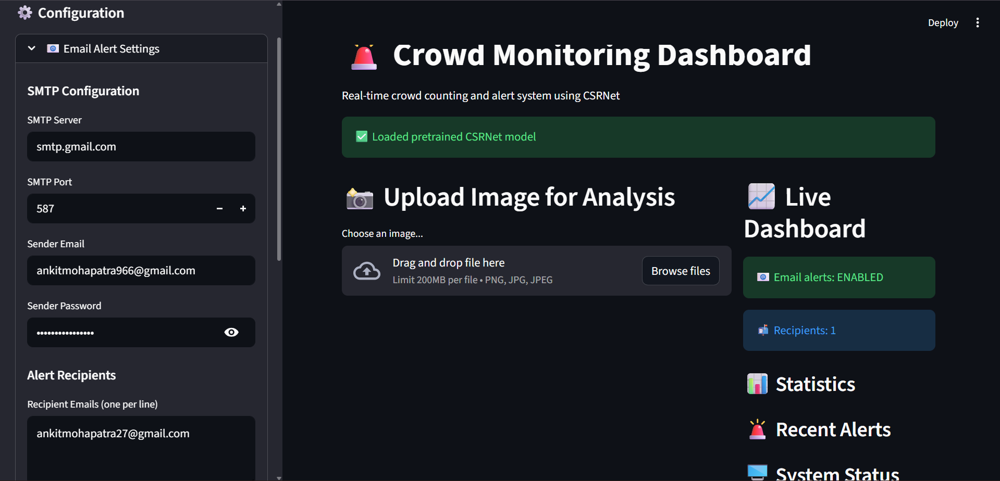
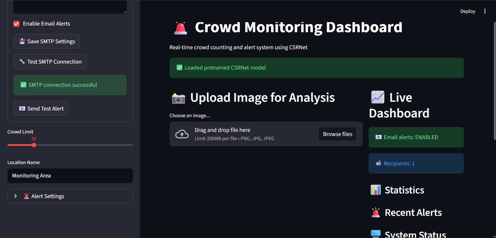
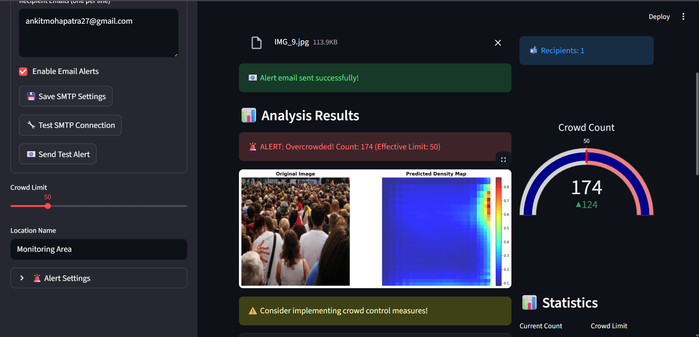
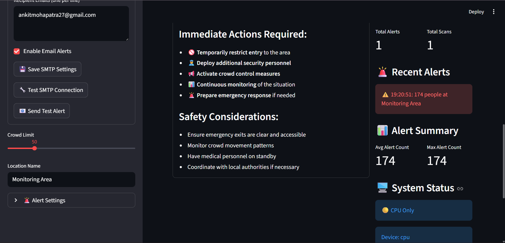
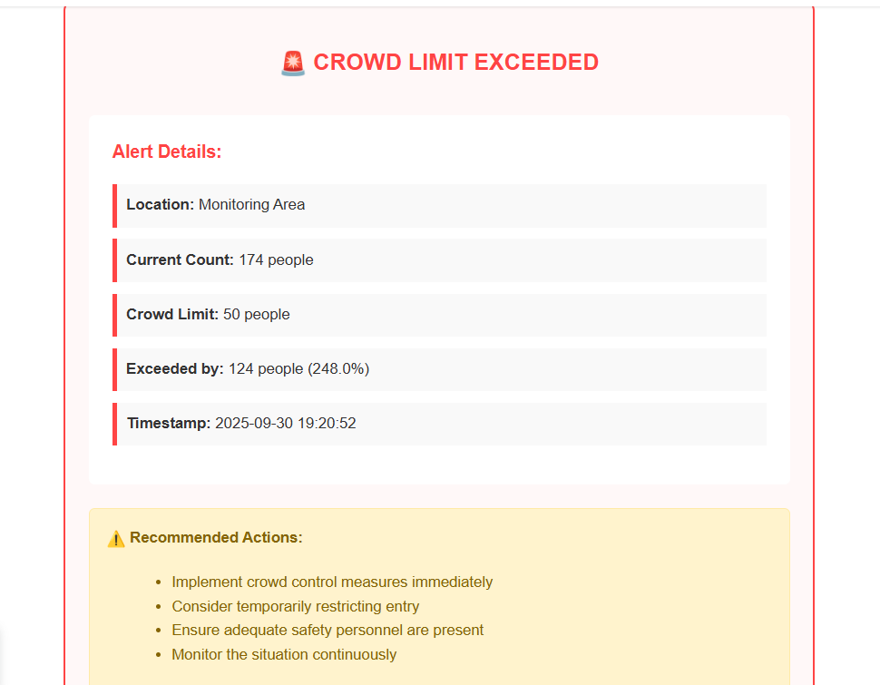

# 🚨 Deep Vision Crowd Monitoring

A **real-time crowd counting and alert system** using **CSRNet (Convolutional Neural Network for Crowd Counting)**.  
This project enables monitoring of crowd density through images, triggering **overcrowding alerts** with email notifications.

---

## 📌 Features
- ✅ Crowd counting using CSRNet deep learning model.  
- ✅ Generates density maps for visualization.  
- ✅ Real-time alerts when crowd exceeds set threshold.  
- ✅ Configurable **SMTP email alerts**.  
- ✅ Interactive **dashboard with statistics & visualizations**.  
- ✅ User-friendly interface for uploading and analyzing images.  

---

## 📊 Dashboard Overview
- **Upload Image for Analysis** – Upload an image and get predicted crowd count.  
- **Predicted Density Map** – Heatmap showing high-density regions.  
- **Crowd Count Gauge** – Displays current count vs. limit.  
- **Alert System** – Sends email when overcrowding detected.  
- **Statistics & Logs** – Track past alerts and counts.  

---

## ⚡ Tech Stack
- **Python 3.10+**
- **PyTorch** – Deep learning framework.  
- **CSRNet** – Pretrained model for crowd counting.  
- **Streamlit** – Interactive dashboard UI.  
- **SMTP** – Email alert system.  
- **OpenCV, NumPy, Matplotlib** – Image processing & visualization.  

---

